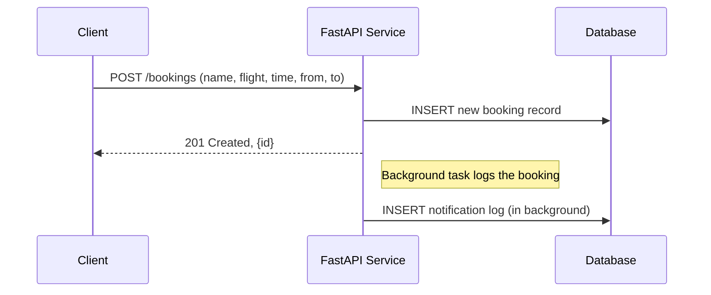

# Transfer Booking Service Architecture

## Executive Summary  
The **Transfer Booking Service** is a small FastAPI application for managing airport transfer bookings. It provides REST endpoints to create, retrieve, update, and list bookings. The service uses a MySQL database (via SQLAlchemy/Alembic) and a lightweight background task for notifications. This design emphasizes simplicity and deliverability in a short timeframe: a single FastAPI app with a database, containerized for local setup. 

## Functional Requirements  
- **Endpoints (FastAPI)**:  
  - `POST /bookings` – Create a new booking with passenger name, flight number, pickup time, pickup/dropoff locations.  
  - `GET /bookings/{id}` – Retrieve a booking by its ID.  
  - `PATCH /bookings/{id}/status` – Update the booking status (`pending` → `confirmed` → `completed` or `cancelled`).  
  - `GET /bookings?date=YYYY-MM-DD` – List all bookings on a given date.  

- **Database (MySQL)**: Define a booking table (with fields: `id`, `passenger_name`, `flight_number`, `pickup_time`, `pickup_location`, `dropoff_location`, `status`, `created_at`, etc.). Use SQLAlchemy ORM models. Include **one index** on the date column (e.g. `pickup_date`) to speed up date-based queries, since we list bookings by date.

- **Migrations**: Use Alembic for schema migrations. Include a migration to create the bookings table and the index.

- **Background Task**: Implement a simple notification log. For example, after creating or updating a booking, use FastAPI’s Background Tasks to simulate writing a notification entry to the database or log (no real message queue is needed for a small demo).

- **Testing**: Write a pytest suite covering at least: booking creation and status updates. Include both unit tests (mocking the database or logic) and an integration test (using a test database or FastAPI’s TestClient) to distinguish the two types. Aim for meaningful coverage of core flows.

- **Project Structure**: Organize code in layers (as discussed in interview): e.g. `models/` (database layer), `schemas/` (Pydantic models), `services/` (business logic), `api/routers/` (FastAPI endpoints), and `main.py`. Include a README with setup instructions and any key design notes (e.g. why an index was chosen).

## Non-Functional Requirements  
- **Simplicity & Delivery Time**: Target a **4-hour implementation**, so the architecture is monolithic (one codebase) and straightforward. Avoid complex frameworks or microservices. This aligns with the advice that small projects and small teams typically use a monolithic approach【90†L61-L66】.
- **Performance**: Minimal latency is needed; index the date field to optimize the date query. Other optimizations (caching, etc.) are overkill for this scope.
- **Reliability**: Basic error handling in the API; ensure database integrity (use transactions via SQLAlchemy). For downtime tolerance, a single small service is sufficient (no need for multi-region).
- **Security**: Validate and sanitize input (FastAPI/Pydantic handles most validation). Use HTTPS in production (out of scope for a 4h demo). Protect against SQL injection by using ORM.
- **Configurability**: Use environment variables or a config file for DB credentials. Document steps in README.
- **Observability**: Use simple logging (Uvicorn/print) for requests and errors. No sophisticated monitoring required given the scope.
- **Deployment**: Package the app with Docker Compose (one service for FastAPI app and one for MySQL) for easy local setup.

## High-Level Architecture  

```mermaid
graph LR
    Client[Client App or Browser] --> API[FastAPI Service]
    API --> DB[(MySQL Database)]
    API --> Task[Background Task (Notification)]
    API --> Logs[Logging]
```

1. **Client** (could be a frontend or API client) sends HTTP requests to the FastAPI service.
2. **FastAPI Service** handles requests, interacts with the database, and enqueues background work.
3. **MySQL Database** stores all booking records.
4. **Background Task** (using FastAPI’s BackgroundTasks) handles asynchronous work (e.g. writing a notification entry).
5. **Logging**: The service logs requests and events to the console or a file for debugging.

This single-container deployment is chosen for simplicity (adding more services would be overkill for one developer in a short test)【90†L61-L66】.

## Data Flow (Example: Create Booking)



- The client posts a booking to the API.  
- The service writes it to MySQL and returns the new ID.  
- A background task asynchronously logs the booking creation (simulating email or SMS notifications).  

## Components and Responsibilities  

- **FastAPI Application**: Implements the REST endpoints and uses SQLAlchemy to interact with the DB. It also triggers background tasks for notifications.
- **Database (MySQL)**: Holds the `bookings` table. Use SQLAlchemy models and Alembic migrations to manage the schema. Ensure an index on the booking date (e.g. `pickup_time` or a derived date field) because we query by date.
- **Background Task Worker**: Not a separate process—use FastAPI’s built-in background tasks. It simply writes a log or notification row to the DB after booking events.
- **Tests (pytest)**:  
  - *Unit tests* for individual functions/services (using mocks or a SQLite memory DB).  
  - *Integration tests* that spin up the FastAPI app (TestClient) with the real database (SQLite or a test MySQL) to exercise end-to-end flows.
- **Containerization (Docker Compose)**: A `docker-compose.yml` defines two services: `app` (FastAPI) and `db` (MySQL). This allows one-command setup and resembles a lightweight production-like environment.
- **README/Documentation**: Explains how to build and run (`docker-compose up`), run migrations, and run tests. Also note any important design decisions (e.g. index choice).

## API Endpoints and Data Model

- **Booking Model** (`booking` table):  
  - `id` (PK)  
  - `passenger_name` (string)  
  - `flight_number` (string)  
  - `pickup_time` (datetime)  
  - `pickup_location`, `dropoff_location` (string)  
  - `status` (enum/string: `pending`/`confirmed`/`completed`/`cancelled`)  
  - `created_at`, `updated_at` (timestamps)  

- **Key Index**: Index on the date part of `pickup_time` (or a generated `pickup_date` column) to speed up the date-filter query (`GET /bookings?date=YYYY-MM-DD`).

- **Endpoints Behavior**:  
  - `POST /bookings`: Validates input, creates a booking with status `pending`, returns its ID.  
  - `GET /bookings/{id}`: Fetches the booking. Returns 404 if not found.  
  - `PATCH /bookings/{id}/status`: Validates status transition (e.g. cannot skip from `pending` to `completed` directly). Updates and returns the new status.  
  - `GET /bookings?date=YYYY-MM-DD`: Queries bookings where `DATE(pickup_time)=date`. Returns a list of bookings (can be paginated if needed).

## Deployment and Topology  

- **Docker Compose Setup**:  
  ```yaml
  version: '3'
  services:
    app:
      build: .
      ports:
        - "8000:8000"
      depends_on:
        - db
    db:
      image: mysql:8
      environment:
        MYSQL_ROOT_PASSWORD: example
        MYSQL_DATABASE: bookings
  ```  
- **Execution**: `docker-compose up` runs both containers. Migrations can run on startup (e.g. via an entrypoint script calling Alembic).
- **CI/CD**: For a small test, manual Git pushes are sufficient. Optionally, a GitHub Action could run `pytest` on push for continuous testing.

## Scalability and Availability  

- **Scalability**: The app is stateless and can be horizontally scaled by running multiple replicas (behind a load balancer). In practice for this test, one instance is enough.
- **Database**: MySQL runs as a single container. In production, you’d add replication or a managed DB for HA, but that’s beyond the 4h scope.
- **Fault Tolerance**:  
  - The app should handle exceptions (e.g. invalid IDs) gracefully.  
  - If the database goes down, the app will error; in a real system, retries or backups would be needed.  
  - Docker Compose provides local resiliency, but no automatic recovery (not required here).

## Security and Observability  

- **Security**: Validate all input with Pydantic models to prevent injection. Use HTTPS in deployment (not shown here). No user authentication is specified for this demo.
- **Logging**: Log incoming requests and important events (booking created, status changed). For simplicity, logs go to stdout/stderr (visible in Docker logs).
- **Monitoring**: Not implemented given scope. One could add basic metrics, but in 4h focus on core features.

## Testing Strategy  

- Write **unit tests** for business logic (e.g. status transitions, model validations). Mock the DB or use a SQLite memory DB.
- Write at least one **integration test** using FastAPI’s TestClient to call the endpoints end-to-end with a test database.
- Ensure tests cover normal flows and edge cases (e.g. invalid status, booking not found).
- Example: a unit test verifies that changing status from `pending` to `completed` without going through `confirmed` is disallowed. An integration test might create a booking and then patch its status.

## Key Decisions and Trade-offs  

- **Monolithic vs Microservices**: We use a single FastAPI service (monolith). This is simpler and delivers quickly. For a small code challenge, microservices would add overhead【90†L61-L66】. 
- **FastAPI**: Chosen (per requirement) for async support and automatic docs. Alternatives like Flask are slower to write for async flows.
- **Background Work**: Use FastAPI’s built-in BackgroundTasks instead of a full Celery/RabbitMQ stack. This keeps the implementation lightweight (no external broker) and suffices for a simple log action.
- **Database**: MySQL is specified; we use SQLAlchemy as required. Could have used SQLite for prototyping, but using MySQL matches real use. We rely on Alembic for schema migrations.
- **Indexing**: We add an index on the date column for performance of the `GET /bookings?date=` query. Without it, filtering by date would require scanning all bookings.
- **Docker Compose**: Selected for quick local setup. Alternatives (e.g. Kubernetes) are unnecessary complexity here.
- **Tests Coverage**: Aim for meaningful coverage of core flows, not 100%. It’s more important to demonstrate understanding (unit vs integration) than to hit an arbitrary percentage.

Each decision favors rapid implementation and clarity over production-grade complexity, matching the 4-hour assignment scope.

